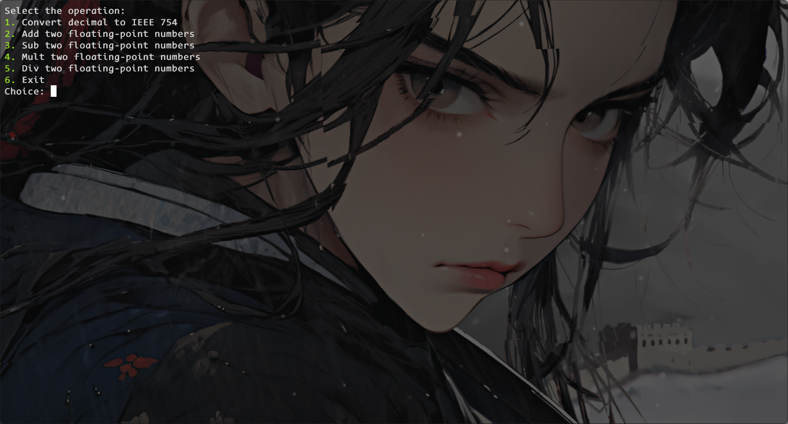
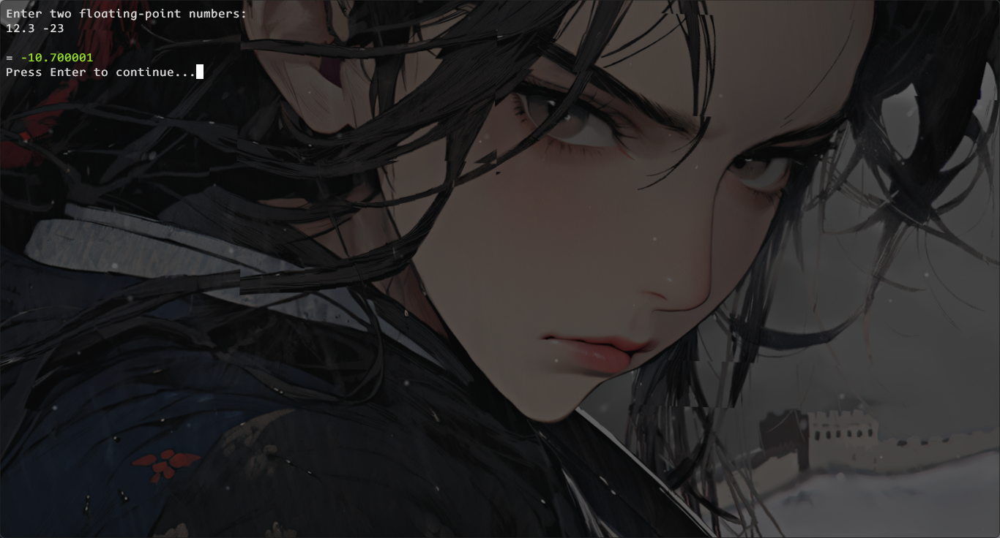

# Float operations realized in RISC-V I32 assembly

* [Float operations realized in RISC-V I32 assembly](#float-operations-realized-in-risc-v-i32-assembly)
   * [简介：](#简介)
   * [1. 整体环境配置：](#1-整体环境配置)
   * [2. 编译环境搭建](#2-编译环境搭建)
      * [2.1. 克隆项目](#21-克隆项目)
      * [2.2. 下载子模块](#22-下载子模块)
      * [2.3. 下载所需要的包：](#23-下载所需要的包)
      * [2.4. 添加环境变量：](#24-添加环境变量)
      * [2.5. 编译gcc：](#25-编译gcc)
      * [2.6. 编译仿真工具：](#26-编译仿真工具)
   * [3. 运行](#3-运行)
   * [4. 具体实现的简述](#4-具体实现的简述)
      * [4.1. 交互程序](#41-交互程序)

## 简介：

本项目旨在使用riscv-I32 ISA实现浮点数的加减乘除运算，同时为使用者提供交互界面。其中：

- 浮点数的加减乘除均是使用基于riscv-I32 ISA指令集的汇编实现，整个程序（比如一个加法），被视作一个C函数（加法函数），这个C函数接受两个uint32_t类型的参数，分别是两个操作数frs1，frs2，然后返回一个同类型的结果。

- 交互界面以及float到ieee754的转化是由C语言编写。转化程序利用Union的特性将浮点转化为相应的二进制编码，详见代码。交互界面只支持linux环境下的系统指令，就是说，如果你再windows下运行该交互程序，可能会出现系统指令无法执行的错误，进而导致无法正常运行。因此建议配置环境尽量与本文相似，我们也会尽快推进windows版本的开发。
  如果你正常运行交互界面，它应该有六个选项，分别是：
  
  - 输入float，转化出IEEE 754格式的二进制编码，以及其十六进制输出
  
  - 输入两个float，输出加法结果
  
  - 输入两个float，输出减法结果
  
  - 输入两个float，输出乘法结果（TODO）
  
  - 输入两个float，输出除法结果（TODO）
  
  - Exit
  
  如果你输入非法指令会弹出报错。

以上就是该项目的大致内容，其运行图片如下：






另外，本项目是重庆大学计算机组成原理课程RISCV版的大作业。


## 1. 整体环境配置：

本实验的编译环境是搭载在Ubuntu22.04上的，可以使用wsl2进行平替，具体安装方法可以参照网上的相关博客，此处不赘述。同时，本项目不能使用root用户进行操作。在正式开始之前，请你确保你已经安装好git，gcc，make等常用工具，可以参考以下命令：

```bash
sudo apt install git make gcc
```

进行这些工具的安装。


## 2. 编译环境搭建

这里主要参考了这个项目：[riscv-collab/riscv-gnu-toolchain: GNU toolchain for RISC-V, including GCC (github.com)](https://github.com/riscv-collab/riscv-gnu-toolchain)，这个项目可以获得完整的riscv工具链。但是由于过程过于繁琐，以及该项目过于庞大（7个G以上，建议把wsl安装在磁盘剩余容量较大的地方，网上有教程【1】）。

### 2.1. 克隆项目

首先将编译源代码克隆到本地：

```bash
git clone https://github.com/riscv/riscv-gnu-toolchain
```

然后进入项目：

```bash
cd riscv-gnu-toolchain
```

### 2.2. 下载子模块

该项目包含众多子模块，但是由于国内网络限制，我们难以使用正常方法将所有模块一次性初始化，因此我将所有的要用的模块地下载命令都整理到"submdules.sh"，只需运行如下命令即可拉取：

```bash
bash ./submodules.sh
```

**注意**，极有可能中途出现断连，你可以从断掉的地方，将从断连处到最底部的命令拷贝下来执行。也可以不运行以上命令，而将所有的指令一条一条从上往下拷贝下来执行。

### 2.3. 下载所需要的包：

运行如下命令：

```bash
sudo apt-get install autoconf automake autotools-dev curl python3 python3-pip libmpc-dev libmpfr-dev libgmp-dev gawk build-essential bison flex texinfo gperf libtool patchutils bc zlib1g-dev libexpat-dev ninja-build git cmake libglib2.0-dev libslirp-dev
```

### 2.4. 添加环境变量：

由于后面要用到编译出的编译器进行后面的编译，因此我们要将其安装位置添加到环境变量（以下采用临时添加）：

```bash
export PATH=/opt/riscv/bin:$PATH
```

### 2.5. 编译gcc：

先创建build文件夹，以免污染环境。进入build之后，运行配置命令，这里使用的是RISCV I64指令集，支持ifencei类的指令，安装位置是"/opt/riscv"。

```bash
mkdir build
cd build

../configure --prefix=/opt/riscv --with-arch=rv64gc_zifencei  
make -j8  # 可以根据自己的硬件情况改变
```

然后查看是否已经可以运行如下命令：

```bash
riscv64-unknown-elf-gcc -v
```

如果没有报错那么就可以进行下一步了.

### 2.6. 编译仿真工具：

这一步将会使用之前编译得到的riscv编译器编译得到riscv的仿真工具，主要步骤如下：

首先我们要将riscv仿真工具的安装路径添加到环境：

```bash
export RISCV=$HOME/riscvtools
```

这里我将它放到用户家目录下的riscvtools。

- ***spike*** ：
  退出build，先进入到"spike/"目录下，然后执行如下命令：
  
  ```bash
  apt-get install device-tree-compiler libboost-regex-dev
  apt install build-essential
  apt install libboost-all-dev
  mkdir build
  cd build
  ../configure --prefix=$RISCV
  make -j8
  sudo make install
  ```

- ***pk***:
  pk工具的安装这里用到了之前的编译器，先进入到"pk/"目录下，然后运行如下指令：
  
  ```bash
  mkdir build
  cd build
  ../configure --prefix=$RISCV --host=riscv64-unknown-elf
  make -j8
  make install
  ```
同时请你运行这个代码以保证程序成功运行：
```bash
alias gcc_riscv64="riscv64-unknown-elf-gcc"
```


> 注意：
> 
> - 如果你发现第二次进入环境时无法识别命令，那么可以再运行一下：
> 
> ```bash
> export PATH=/opt/riscv/bin:$PATH
> export RISCV=$HOME/riscvtools
> ```


## 3. 运行

将编译器添加到环境变量，同时将"riscv64-unknown-elf-gcc"映射为"gcc-riscv64"（为了使命令更简单），然后我们回到含有main.c的路径下，先创建"./bin/"，然后运行如下指令：

```bash
gcc_riscv64 main.c ./src/asm_riscv/add.s ./src/asm_riscv/mult.s ./src/asm_riscv/divi.s ./src/c/interactor.c -o ./bin/main
```

就是"compile.txt"中的命令，即可在"./bin/"中生成可执行文件"main"。然后输入以下指令：

```bash
spike pk main
```

即可运行程序。


## 4. 具体实现的简述

该项目的整体文件结构如下：

```bash
.
├── LICENSE
├── README.md
├── assets
│   ├── addition.png
│   ├── float2ieee754.png
│   └── startPage.png
├── bin
│   └── main
├── compile.txt
├── include
│   └── headers.h
├── main.c
└── src
    ├── asm_riscv
    │   ├── add.s
    │   ├── divi.s
    │   └── mult.s
    └── c
        └── interactor.c
```

其中，main.c是整个程序的入口，include是所有所需的函数和全局变量的声明，src是汇编函数（加减乘除）和C函数（交互命令，浮点转化，输入输出）的源代码。其中，compile.txt是编译命令。

### 4.1. 交互程序

交互程序是由case语句完成，同时利用无限循环使得只有在选择页面选择"Exit"时推出程序。以下我们将介绍我们程序的实现：

- 转换器：我们使用了C语言中Union的特性，简单地实现了该部分。我们先创建一个Union，然后


